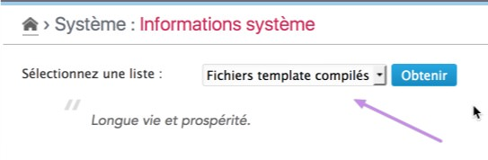

# System information plugin for Dotclear 2

!!! tip "Current release"
    [1.9.2 - 2020-02-20][ot-dl] (Dotclear 2.14+)

This plugin give some information about your Dotclear installation. It may be useful for developers, theme designers, …

!!! warning
	This plugin is accessible only to the super-administrator(s) as it may reveal some sensible information.

## Installation

The plugin may be downloaded and installed from following sources:

 * [DotAddict](https://plugins.dotaddict.org/dc2/details/sysInfo)
 * [Open-Time][ot-dl]
 * [Github](https://github.com/franck-paul/sysInfo/releases)

Or directly from the administration plugins page of Dotclear

## Usage

The plugin is directly accessible from the **System settings** menu, as soon as it is installed. It provides some lists of information[^1]:

 * [Compiled template files](user-guide/tpl-files)
 * [Repository plugins list](user-guide/repo-plugins)
 * [Repository themes list](user-guide/repo-themes)
 * [Template paths](user-guide/tpl-paths)
 * [URL handlers](user-guide/url-handlers)
 * [Administrative and public behaviors](user-guide/behaviors)
 * [Dotclear constants](user-guide/constants)
 * [Administrative registered URLs](user-guide/admin-urls)
 * [Editors and syntaxes supported](user-guide/editors)
 * [Plugins](user-guide/plugins)
 * [Registered REST methods](user-guide/rest-methods)
 * [PHP Info](user-guide/phpinfo)
 * [Static cache files](user-guide/static-cache)[^2]

And it provides also a setting to [deactivate the HTTP cache](user-guide/http-cache).

[^1]: The list is provided as soon as you click on "Check" button or when you select another item.

[^2]: This item is only available if the static cache plugin is installed and enabled.

[ot-dl]: https://open-time.net/post/2020/02/20/Plugin-sysInfo-193-pour-Dotclear
