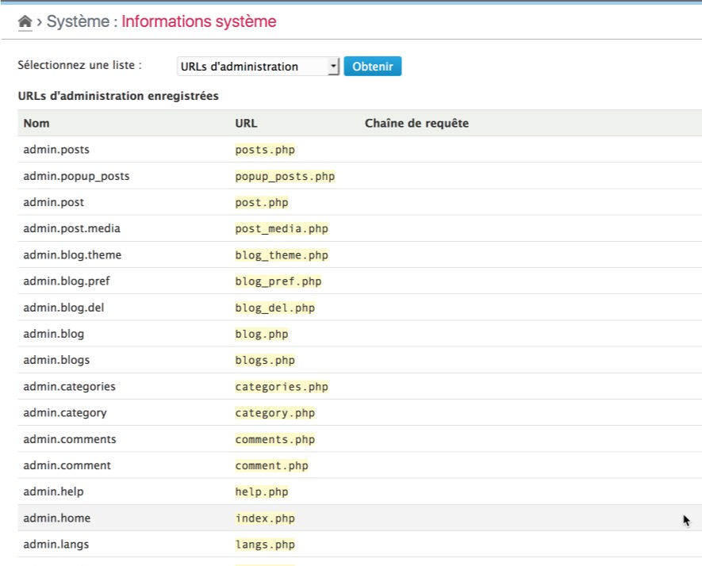

Administrative URL
==============

!!! note
	All information given here by the plugin is only related to the **platform** and its **enabled** plugins.


Get the list
------------

Select the "Admin URLs" option in the checklist and click on "Check" button[^1]. The plugin will then display the full list of administrative URLs registered, including the standard ones (provided by Dotclear core and plugins of the distribution):



This list includes the Type, the name of the URL, the relative address of the URL (normally based on the ```DC_ADMIN_URL``` defined in the ``ìnc/config.php``` file) and its optional Query string.

[^1]: You will not have to click to the "Check" button if it was another checklist selected before.
