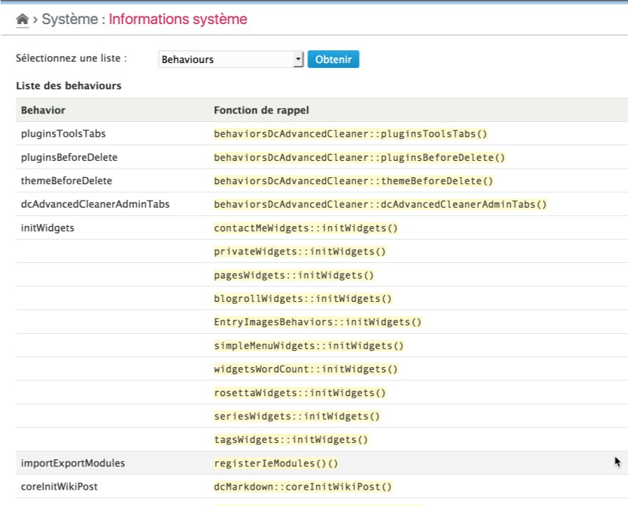
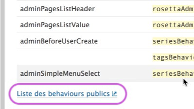
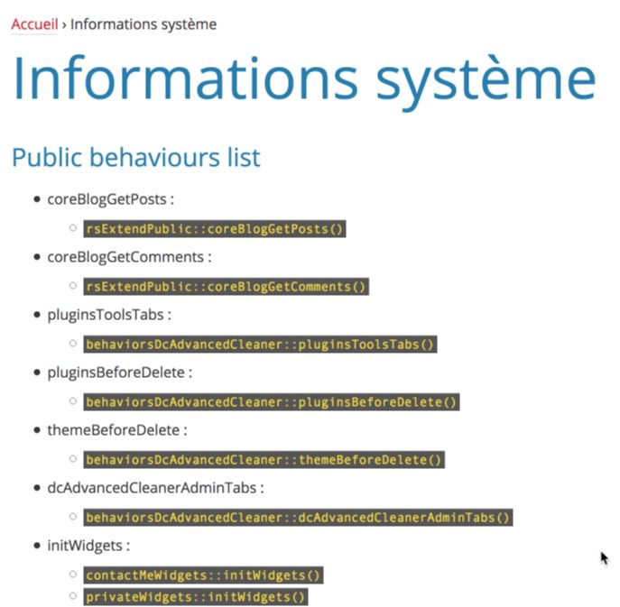

Behaviors
==============

!!! note
	All information given here by the plugin is only related to the **current blog** and its **activated** theme and **enabled** plugins.

Get the list
------------

!!! tip
	The behaviors without any callback function(s) registered are not listed on these lists. The list of callback functions is given in the calling order (first listed will be the first called).

Select the "Behaviors" option in the checklist and click on "Check" button[^1]. The plugin will then display the full list of behaviors:

This list includes the behavior name and the list of callback functions.

!!! note
	This list includes only administrative registered behaviors.

Below the list a link is provided to display the list of the public behaviors:

A new window will be open to display this particular list which includes, as for the administrative list, the name of each behavior and its list of callback functions:

[^1]: You will not have to click to the "Check" button if it was another checklist selected before.
