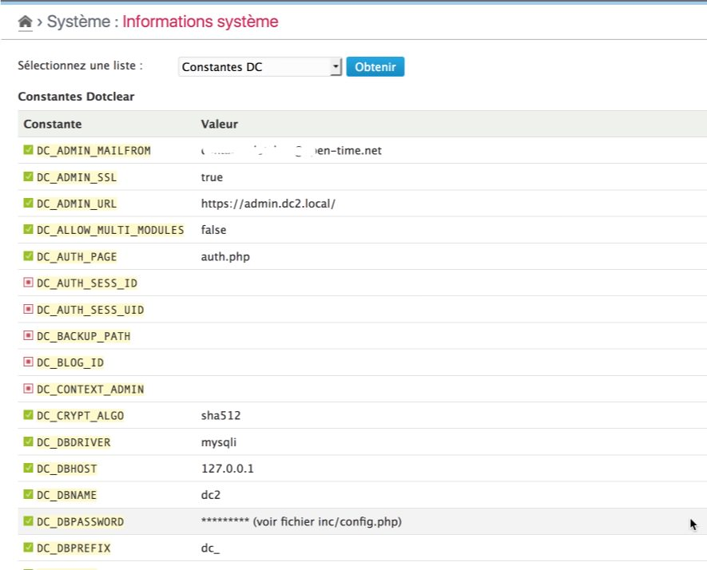

Constants
==============

!!! note
	All information given here by the plugin is related to the **platform**.


Get the list
------------

Select the "DC Constants" option in the checklist and click on "Check" button[^1]. The plugin will then display the full list of known Dotclear constants:



This list includes the name of each constant and its value if defined.

!!! note
	Some "sensible" constants (password, master key, …) are not displayed here. You will have to check them directly in your ``ìnc/config.php``` file.

[^1]: You will not have to click to the "Check" button if it was another checklist selected before.
