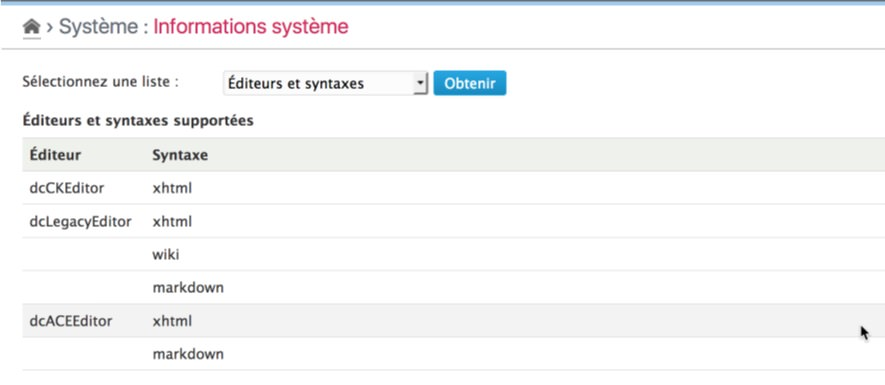

Editors
==============

!!! note
	All information given here by the plugin is only related to the **current blog** and its **enabled** plugins.

Get the list
------------

Select the "Editors and Syntaxes" option in the checklist and click on "Check" button[^1]. The plugin will then display the full list of editors and their supported syntaxes:

[^1]: You will not have to click to the "Check" button if it was another checklist selected before.
