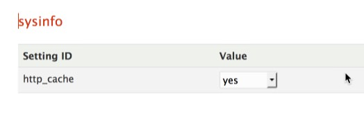

HTTP Cache
==============

You can disabled the HTTP cache managed by Dotclear with sysInfo plugin. In order to deactivate it for the blog or the platform, change the value of the ```http_cache``` value (```sysinfo``` section) in **about:config** (System settings menu):



This setting will impact the cache information provided (in headers) by Dotclear when serving requested documents.

!!! tip
	If you want to deactivate (or activate) the HTTP cache for the **blog**, do the modification in the "Settings for ```<blog>```" tab, else do it in the "Global settings" tab.
