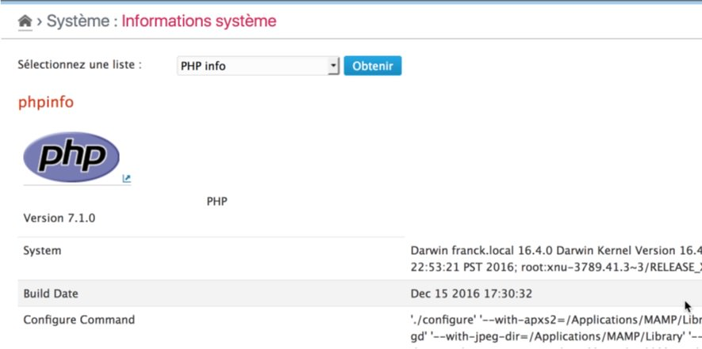

PHP Info
==============

!!! note
	All information given here by the plugin is related to the **platform**.

Get the list
------------

Select the "PHP info" option in the checklist and click on "Check" button[^1]. The plugin will then display the standard PHP info for the platform:

[^1]: You will not have to click to the "Check" button if it was another checklist selected before.
