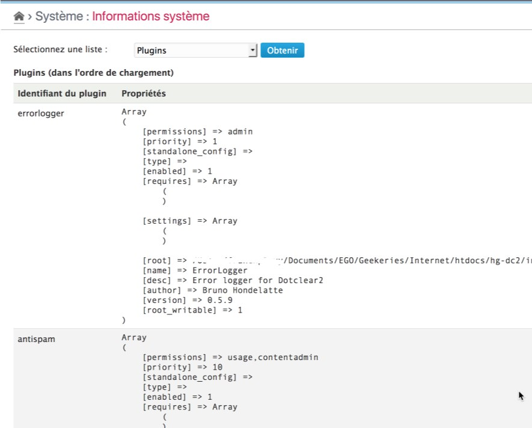

Plugins
==============

!!! note
	All information given here by the plugin is only related to the **platform** and its **enabled** plugins.

Get the list
------------

Select the "Plugins" option in the checklist and click on "Check" button[^1]. The plugin will then display the full list of plugins, including the plugins of the distribution:

This list includes the plugin id (internal name) and all its properties.

!!! note
	The plugins are listed in loading order, higher order first.

[^1]: You will not have to click to the "Check" button if it was another checklist selected before.
