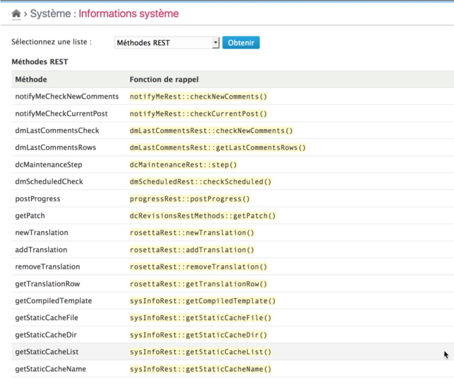

REST Methods
==============

!!! note
	All information given here by the plugin is only related to the **platform** and its **enabled** plugins.

Get the list
------------

Select the "REST methods" option in the checklist and click on "Check" button[^1]. The plugin will then display the full list of registered REST method (provided by Dotclear core and plugins of the distribution):

This list includes the method's name and its callback function.

[^1]: You will not have to click to the "Check" button if it was another checklist selected before.
