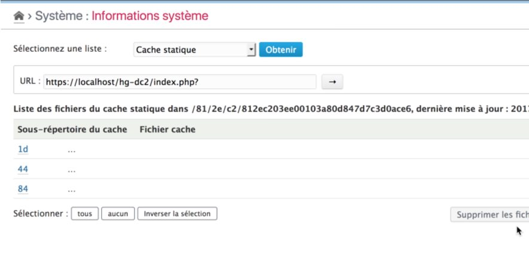
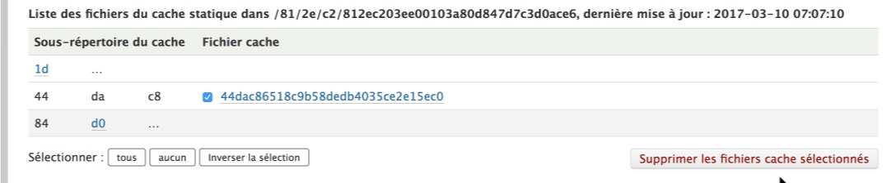
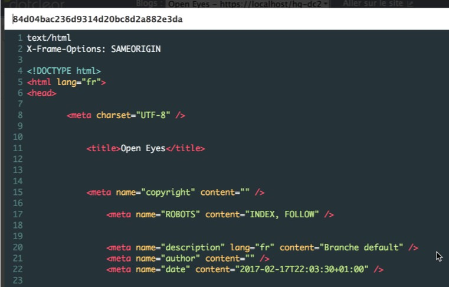
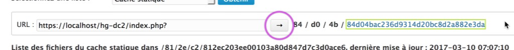
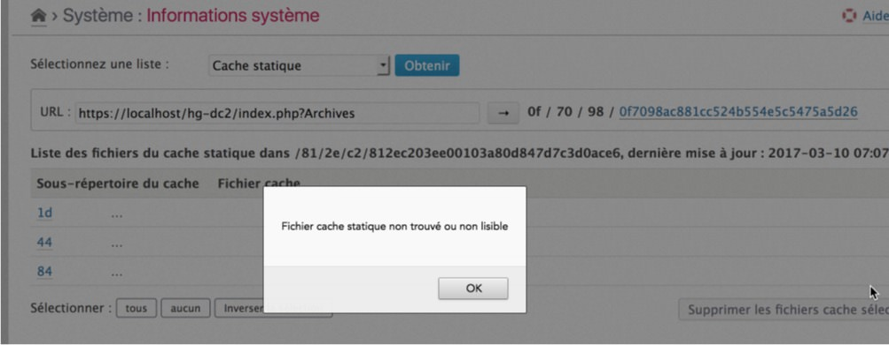

Static cache
==============

!!! note
	All information given here by the plugin is only related to the **current blog** and its **activated** theme and **enabled** plugins.

Get the list
------------

!!! warning
	This checklist is only available if the Static cache pugin is **installed and enabled**.

Select the "Static cache" option in the checklist and click on "Check" button[^1]. The plugin will then display an static cache URL calculator and the list of first level existing static cache folders:

You can "unfold" each 1st level folder, and then 2nd level folder to display the contained sub-folders and files. Each of these files can then be selected and deleted using the commands below the list:

!!! tip
	You can also delete all static cache files by using the related command in the **Maintenance** plugins

You can also preview the content of each files:

Using the calculator
--------------------

An static cache file URL calculator is provided in order to determinate the associated static cache file for a given URL:

Give the desired URL and click on the right arrow button to calculate the static cache path and filename. You will be able then to preview the content of the file by clicking on its name and you will be alerted if it does not exists:

[^1]: You will not have to click to the "Check" button if it was another checklist selected before.
