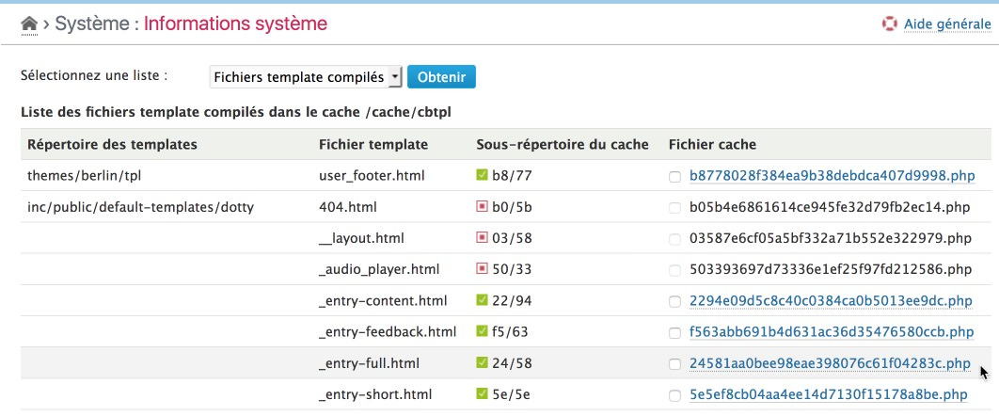
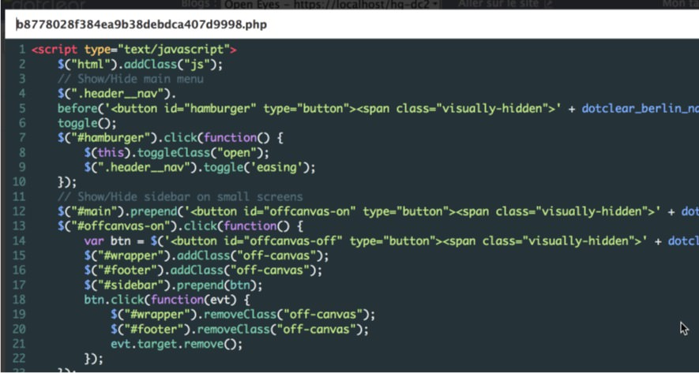

Template files
==============

!!! note
	All information given here by the plugin is only related to the **current blog** and its **activated** theme and **enabled** plugins.

Get the list
------------

Select the "Compiled templates" option in the checklist and click on "Check" button[^1]. The plugin will then display the full list of template files whether or not the corresponding compiled file exists:

Each "potential" template file is listed, with its source path and the related cache path and filename.

If a compiled template file exists, you can preview it by clicking on its cache filename or select it for deletion. Related commands are displayed below the list:

!!! tip
	You can also delete all compiled template files by using the related command in the **Maintenance** plugins

[^1]: You will not have to click to the "Check" button if it was another checklist selected before.
