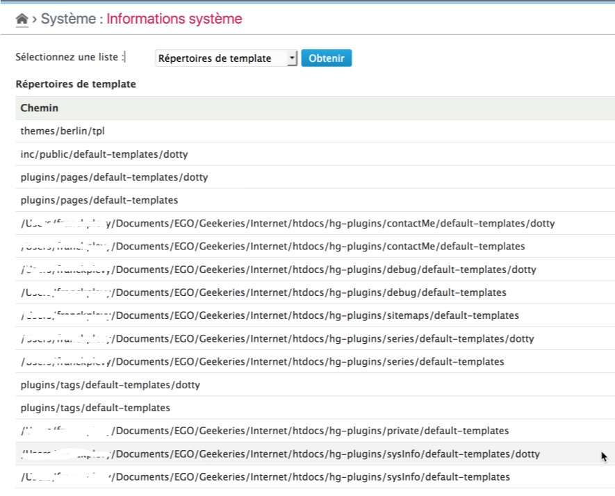

Template paths
==============

!!! note
	All information given here by the plugin is only related to the **current blog** and its **activated** theme and **enabled** plugins.


Get the list
------------

Select the "Template paths" option in the checklist and click on "Check" button[^1]. The plugin will then display the full list of template files source paths:



This list includes the source paths from the currently activated theme of the current blog, the according templateset, the list of plugin's source paths[^2].

[^1]: You will not have to click to the "Check" button if it was another checklist selected before.

[^2]: As far as the plugins use the standard ```default-templates[\<templateset-name>]``` folder names.
