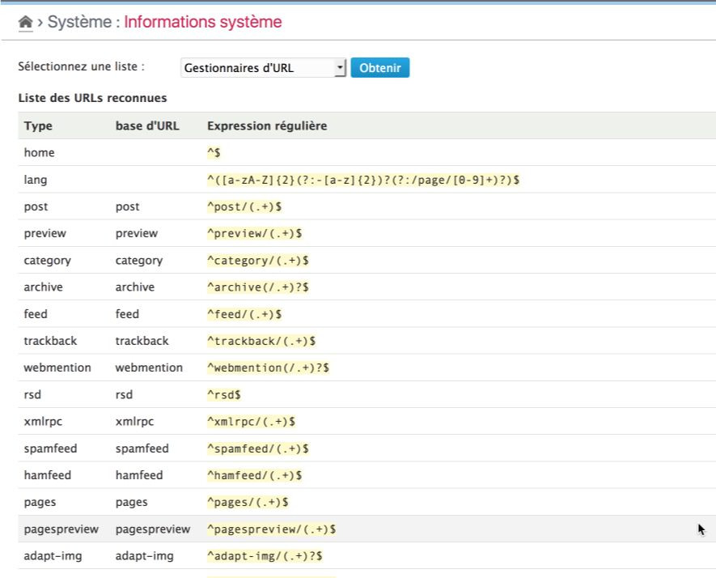

URL handlers
==============

!!! note
	All information given here by the plugin is only related to the **platform** and its **enabled** plugins.

Get the list
------------

Select the "URL handlers" option in the checklist and click on "Check" button[^1]. The plugin will then display the full list of URL handlers, including the standard ones (provided by Dotclear core and plugins of the distribution):

This list includes the Type, the base URL used by the handler and the regular expression used to verify if an URL should be treated by the URL handler.

[^1]: You will not have to click to the "Check" button if it was another checklist selected before.
